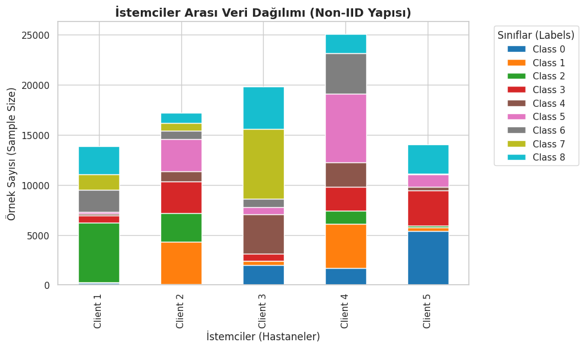

# 🧬 Federated Learning Optimization on Medical Data using ABC Algorithm

[](https://python.org)
[](https://pytorch.org/)
[](https://medmnist.com/)
[](../LICENSE)
[](./Federated_Learning_MedMNIST_Optimization.ipynb)

> **Real-world application of `abc-optimizer-lib`:** Optimizing Federated Learning hyperparameters (Learning Rate & Momentum) on Non-IID medical data to achieve state-of-the-art performance.

---

## 📖 Overview

**Federated Learning (FL)** enables training AI models on distributed private data (e.g., in hospitals) without data ever leaving the local devices. However, statistical heterogeneity (**Non-IID data**) among clients often degrades the global model's performance.

This project demonstrates how the **Artificial Bee Colony (ABC)** algorithm can autonomously tune the hyperparameters of the FedAvg algorithm to overcome Non-IID challenges.

**Key Technologies:**
* **Dataset:** [MedMNIST (PathMNIST)](https://medmnist.com/) - Colorectal cancer histology.
* **Optimization:** `CanonicalABCSolver` from [abc-optimizer-lib](https://github.com/yusufkorkmazyigit/abc-optimizer-lib).
* **Architecture:** Convolutional Neural Network (CNN) with Federated Averaging (FedAvg).

---

## ⚙️ Methodology

### 1. Non-IID Data Partitioning
To simulate a real-world medical scenario, the PathMNIST dataset was distributed among **5 Clients (Hospitals)** using a **Dirichlet Distribution ($\alpha=0.5$)**. This creates a high class imbalance between clients.


*Figure 1: Heterogeneous data distribution among 5 clients.*

### 2. ABC-Based Optimization
Instead of using fixed hyperparameters, we utilized the **ABC Algorithm** to search for the optimal:
* **Learning Rate ($lr$):** Search Space $[0.001, 0.1]$
* **Momentum ($m$):** Search Space $[0.0, 0.9]$

The fitness function was defined as the validation loss after a short "proxy" training session (3 communication rounds).

---

## 📊 Experimental Results

We compared the proposed **ABC-FedAvg** method against a standard **FedAvg** baseline and an ideal **Centralized** training scenario.

### Performance Comparison
| Method | Learning Rate | Momentum | Accuracy (%) | Note |
| :--- | :--- | :--- | :--- | :--- |
| **Standard FedAvg** | 0.010 | 0.500 | 78.05% | Baseline |
| **ABC-FedAvg (Ours)**| **0.069** | **0.573** | **85.28%** | **+7.23% Improvement** |
| *Centralized* | *0.010* | *0.500* | *81.82%* | *Upper Bound* |

### Convergence Analysis
The ABC-optimized model (Blue line) demonstrated faster convergence and higher stability compared to the standard approach, even surpassing the centralized baseline in later rounds.


*Figure 2: Test Accuracy over 20 Communication Rounds.*


*Figure 3: Smoothed trend analysis showing stability.*

---

## 🚀 How to Run

1.  **Install Dependencies:**
    ```bash
    pip install torch torchvision medmnist matplotlib seaborn
    ```

2.  **Install the ABC Optimizer Library:**
    ```bash
    pip install git+[https://github.com/yusufkorkmazyigit/abc-optimizer-lib.git](https://github.com/yusufkorkmazyigit/abc-optimizer-lib.git)
    ```

3.  **Run the Notebook:**
    Open `Federated_Learning_MedMNIST_Optimization.ipynb` in Jupyter or Google Colab.

---

## 👨‍💻 Author & Acknowledgment

This project was developed by **Yusuf Korkmazyiğit** under the supervision of **Prof. Dr. Bahriye Akay** at **Erciyes University, Department of Computer Engineering**.

Special thanks to the open-source community for the MedMNIST dataset and PyTorch framework.

---